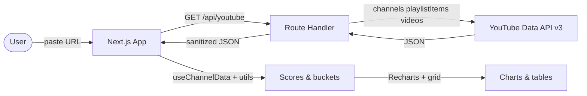

# ChannelSpy


> You have ten competitor tabs open and a spreadsheet that is already wrong.

**ChannelSpy** is a Next.js app that turns any public YouTube channel into a **clean analytics report** in one paste: KPIs, trend charts, sortable video intelligence, plain-language “Quick Read” cards, and a **decision-ready CSV export** — without exposing API keys in the browser.

Built as a full-stack project to explore **App Router**, **server-only secrets**, **Recharts**, and **quota-conscious** YouTube Data API v3 usage.

---

## Demo

**Live:** [channelspy.vercel.app](https://channelspy.vercel.app)

```
User pastes @handle, /channel/ID, or full YouTube URL
           ↓
  Next.js route handler fetches channel + uploads playlist + video stats
           ↓
  Client merges data: Long vs Shorts buckets, scores, momentum, consistency
           ↓
  Dashboard: Quick Read → KPIs → charts → filterable video grid → Export CSV
```

---

## Architecture



---

## Tech Stack

| Layer | Technology | Why |
| --- | --- | --- |
| Framework | **Next.js 16** (App Router) | SSR-friendly app + API routes in one repo |
| UI | **React 19**, **Tailwind CSS v4** | Fast iteration, dark SaaS layout |
| Charts | **Recharts** | Composable charts for trends and comparisons |
| Data | **YouTube Data API v3** | Official channel, playlist, and video statistics |
| Quality | **Vitest**, **ESLint** | Fast unit tests for core `lib/utils` without a browser |
| Styling tokens | **shadcn/tailwind.css** | Consistent design variables |

---

## Technical Highlights

**Server-side API proxy** — `YOUTUBE_API_KEY` is read only in `src/app/api/youtube/route.ts`. The client calls same-origin `/api/youtube`; the key never ships to the browser.

**Playlist-first ingestion** — The app walks the channel **uploads playlist** (`playlistItems` + batched `videos`) instead of abusing `search.list`, keeping quota use predictable for deep reports.

**Long vs Shorts split** — Videos are classified by duration (≤3 minutes = Short). Averages, momentum, and charts stay meaningful instead of blending incompatible formats.

**Performance score (0–100)** — Per video: **views vs channel average** (capped at 3×, up to **55** pts) plus **engagement vs channel average** (capped at 3×, up to **45** pts). Top performers land in a **70–90+** range on healthy channels.

**CSV export** — UTF-8 BOM for Excel, a short metadata block, then rows sorted by score with human column names (`Views`, `Performance Tier`, `Views vs Channel Avg %`, etc.).

**Structured errors** — API returns typed error codes (`NOT_FOUND`, `QUOTA_EXCEEDED`, `INVALID_INPUT`, …) so the UI can show specific recovery copy.

---

## Getting Started

### Prerequisites

- **Node.js** 18+
- [Google Cloud](https://console.cloud.google.com/) project with **YouTube Data API v3** enabled

### Install & run

```bash
git clone https://github.com/rrubayet321/ChannelSpy.git
cd ChannelSpy
npm install
```

Create `.env.local` (never commit it):

```bash
YOUTUBE_API_KEY=your_youtube_data_api_v3_key
```

```bash
npm run dev
# → http://localhost:3000
```

### Scripts

| Command | Description |
| --- | --- |
| `npm run dev` | Development server |
| `npm run build` | Production build |
| `npm run start` | Run production server |
| `npm run lint` | ESLint |
| `npm run test` | Vitest (`src/**/*.test.ts`) |

---

## API Reference

Single route: **`GET /api/youtube`** — all actions via query parameters.

| `action` | Required params | Description |
| --- | --- | --- |
| `channel` | `handle` **or** `channelId` | Resolve channel metadata + uploads playlist id |
| `videos` | `playlistId` | Page through playlist items (optional `pageToken`, `maxResults`) |
| `stats` | `ids` (comma-separated video ids, max 50) | Snippet + statistics + contentDetails per video |

**Errors** — JSON body `{ error: { code, message } }` with appropriate HTTP status (400 / 404 / 429 / 500 / 502).

---

## Tests

Unit tests mock **nothing** for YouTube — they target **pure helpers** (`parseChannelUrl`, `formatViews`, `calcPerformanceScore`, …) so CI stays fast and credential-free.

```bash
npm run test
# 11 tests, sub-second
```

---

## Known Limitations

- Fetches are capped (e.g. **200** recent uploads per analysis) to stay within reasonable quota and latency.
- **Momentum** and **consistency** need enough published videos; small channels may show `0` or `~N/A` where data is insufficient.
- Thumbnails rely on YouTube/Google CDNs; `next.config.ts` `images.remotePatterns` must include hosts your deployment uses.

---

## License

[MIT](LICENSE)

---

Built by **[Rubayet Hassan](https://github.com/rrubayet321)** · [ChannelSpy on GitHub](https://github.com/rrubayet321/ChannelSpy)
