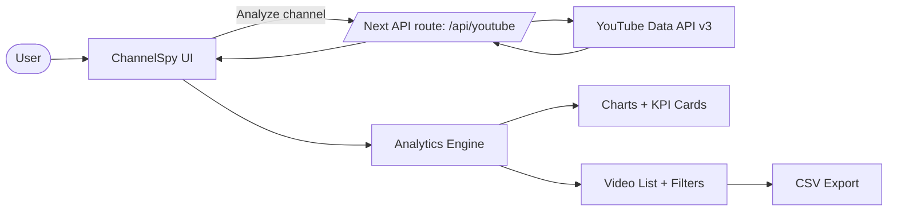

# ChannelSpy


> Paste any YouTube channel URL and get a clean, client-ready competitor analytics dashboard in seconds.

**ChannelSpy** is a modern SaaS-style YouTube competitor intelligence MVP. It helps creators and teams quickly understand channel performance using plain-language metrics, trend charts, and exportable video insights.

---

## Demo Flow

```
User pastes a channel URL or @handle
          ↓
ChannelSpy fetches channel, videos, and stats via secure server route
          ↓
Dashboard opens in report mode (Long Videos / Shorts tabs)
          ↓
User reads quick summary + key metrics + trends
          ↓
User filters/sorts videos and exports CSV report
```

---

## Features

### Core MVP Requirements
- Channel input with URL/handle parsing
- Video list with key metrics (views, audience connection, video strength, trend)
- Sorting and filtering (date presets, min views, sort options)
- Responsive layout across desktop and mobile

### Bonus Features
- Charts for views trend, audience connection, top videos, and recent winners vs baseline
- Trending indicators (momentum + above/below channel average)
- CSV export for report sharing
- Long Videos vs Shorts analytics tabs
- Client-friendly, non-technical metric labels

---

## Architecture



---

## Tech Stack

| Layer | Technology | Why |
|---|---|---|
| Frontend | Next.js App Router · React · TypeScript | Fast product UI with strong typing |
| Styling | Tailwind CSS v4 · shadcn/ui patterns | Clean, modern SaaS design system |
| Data Viz | Recharts | Lightweight charts for trend storytelling |
| API | Next.js Route Handler (`/api/youtube`) | Keeps API key server-side |
| Data Source | YouTube Data API v3 | Channel/video metadata + stats |
| Utilities | date-fns · Lucide icons | Formatting and UI clarity |

---

## Getting Started

### Prerequisites
- Node.js 18+
- YouTube Data API key

### Setup

```bash
git clone https://github.com/rrubayet321/ChannelSpy.git
cd ChannelSpy
npm install
```

Create `.env.local`:

```bash
YOUTUBE_API_KEY=your_api_key_here
```

Run:

```bash
npm run dev
```

Open [http://localhost:3000](http://localhost:3000).

---

## Scripts

```bash
npm run dev     # start local dev server
npm run build   # production build
npm run start   # run production server
npm run lint    # eslint checks
npm run test    # vitest unit tests (lib/utils)
```

---

## Product Notes

- Report mode is intentionally optimized for non-technical client demos.
- Advanced detail sections are progressively disclosed to reduce cognitive load.
- Long-form and Shorts are analyzed independently to avoid mixed signals.

---

## Known Limitations

- YouTube quota limits may temporarily block fresh analysis.
- Very new/small channels can produce low-confidence trends.
- No formal automated test suite yet (linting is enforced).

---

Built by [Rubayet Hassan](https://github.com/rrubayet321)
