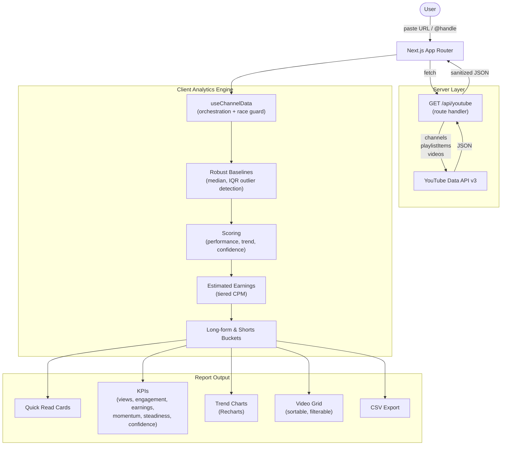

# ChannelSpy


> You have ten competitor tabs open and a spreadsheet that is already wrong.

**ChannelSpy** is a Next.js app that turns any public YouTube channel into a **clean analytics report** in one paste: KPIs, trend charts, estimated earnings, sortable video intelligence, plain-language "Quick Read" cards, and a **decision-ready CSV export** — without exposing API keys in the browser.

It's designed to stay **easy to understand**: key metrics include short "What this means" tooltips, baselines avoid being thrown off by one viral outlier, and estimated earnings give a quick revenue signal per video and per channel.

Built as a full-stack project to explore **App Router**, **server-only secrets**, **Recharts**, **Core Web Vitals optimization**, and **quota-conscious** YouTube Data API v3 usage. Features a premium, minimalist **Antarys/YC-inspired dark mode UI** with robust full-funnel analytics.

---

## Demo

**Live:** [channelspy.vercel.app](https://channelspy.vercel.app)

```
User pastes @handle, /channel/ID, or full YouTube URL
           |
  Next.js route handler fetches channel + uploads playlist + video stats
           |
  Client merges data into Long vs Shorts buckets
           |
  Analytics engine: robust baselines, outlier detection, earnings estimates
           |
  Dashboard: Quick Read -> KPIs -> charts -> filterable video grid -> Export CSV
```

---

## Architecture



---

## Tech Stack

| Layer | Technology | Why |
| --- | --- | --- |
| Framework | **Next.js 16** (App Router) | SSR-friendly app + API routes in one repo |
| UI | **React 19**, **Tailwind CSS v4** | Fast iteration, dark SaaS layout |
| Charts | **Recharts** | Composable charts for trends and comparisons |
| Data | **YouTube Data API v3** | Official channel, playlist, and video statistics |
| Analytics | **GA4 & Microsoft Clarity** | Full funnel tracking and user behavior insights |
| Quality | **Vitest**, **ESLint** | Fast unit tests for core `lib/utils` without a browser |
| Styling tokens | **shadcn/tailwind.css** | Consistent design variables |

---

## Technical Highlights

| Area | What it does |
| --- | --- |
| **Server-side API proxy** | `YOUTUBE_API_KEY` lives only in the route handler — the key never ships to the browser. |
| **Playlist-first ingestion** | Walks the channel **uploads playlist** (`playlistItems` + batched `videos`) instead of `search.list`, keeping quota use predictable. |
| **Race-condition guard** | `useChannelData` tracks a request generation counter via `useRef` so rapid re-searches or clears never let stale data overwrite the UI. |
| **Long vs Shorts split** | Videos ≤3 min = Short. Averages, momentum, charts, and earnings stay meaningful per format. |
| **Robust baselines** | "Typical Views" uses a **median-first** baseline, smoothed with IQR bounds, so one viral hit doesn't skew comparisons. |
| **Outlier detection** | Videos far outside IQR bounds are tagged **"Unusual spike"** — visible, but excluded from the baseline math. |
| **Estimated Earnings** | **Tiered CPM** model ($1.50 - $5.50) applied per-video based on view count. Totals aggregated per bucket and displayed as a KPI, per-video badge, and in CSV export. Clearly disclaimed as estimates. |
| **Beat-usual rate** | Share of uploads that exceed the channel's typical baseline — a quick signal for repeat winners vs one-off hits. |
| **Confidence label** | **Low / Medium / High** indicator based on sample size so users don't over-trust tiny samples. |
| **Performance score** | Per video: views vs typical baseline (up to **55** pts) + engagement vs channel avg (up to **45** pts). Top performers land **70-90+**. |
| **Plain-language UX** | Key metrics have short "What this means" `InfoTooltip` hover explanations; technical jargon replaced with everyday words. |
| **CSV export** | UTF-8 BOM for Excel, metadata block, rows sorted by score with human column names including **Estimated Earnings**. |
| **Structured errors** | API returns typed codes (`NOT_FOUND`, `QUOTA_EXCEEDED`, `INVALID_INPUT`, ...) so the UI shows specific recovery copy. |
| **Core Web Vitals** | Defers ~140KB of JS payload using Next.js `next/dynamic` to lazy-load all Recharts components until the user hits the report view. Adds `preconnect` and `dns-prefetch` hints for external assets. |
| **Comprehensive Analytics** | Full funnel instrumentation (11 distinct typed events e.g., `input_started`, `analyze_success`) mapped into a seamless, session-deduplicated pipeline bridging GA4 and Clarity. |
| **Minimalist Aesthetic** | Employs an Antarys/YC startup-inspired design system: high-contrast typography (DM Serif Display + Inter), lightweight pure CSS animated ambient gradient orbs, and native SVG wordmarks without the bloat. All mobile tap-targets are >44px and dead clicks are fully resolved. |

---

## Getting Started

### Prerequisites

- **Node.js** 18+
- [Google Cloud](https://console.cloud.google.com/) project with **YouTube Data API v3** enabled

### Install & run

```bash
git clone https://github.com/rrubayet321/ChannelSpy.git
cd ChannelSpy
npm install
```

Create `.env.local` (never commit it):

```bash
YOUTUBE_API_KEY=your_youtube_data_api_v3_key
```

```bash
npm run dev
# -> http://localhost:3000
```

### Scripts

| Command | Description |
| --- | --- |
| `npm run dev` | Development server |
| `npm run build` | Production build |
| `npm run start` | Run production server |
| `npm run lint` | ESLint |
| `npm run test` | Vitest (`src/**/*.test.ts`) |

---

## API Reference

Single route: **`GET /api/youtube`** — all actions via query parameters.

| `action` | Required params | Description |
| --- | --- | --- |
| `channel` | `handle` **or** `channelId` | Resolve channel metadata + uploads playlist id |
| `videos` | `playlistId` | Page through playlist items (optional `pageToken`, `maxResults`) |
| `stats` | `ids` (comma-separated video ids, max 50) | Snippet + statistics + contentDetails per video |

**Errors** — JSON body `{ error: { code, message } }` with appropriate HTTP status (400 / 404 / 429 / 500 / 502).

---

## Tests

Unit tests mock **nothing** for YouTube — they target **pure helpers** (`parseChannelUrl`, `formatViews`, `calcPerformanceScore`, `calcEstimatedEarnings`, ...) so CI stays fast and credential-free.

```bash
npm run test
# 17 tests, sub-second
```

---

## Known Limitations

- Fetches are capped (e.g. **200** recent uploads per analysis) to stay within reasonable quota and latency.
- **Momentum**, **steadiness**, and **confidence** need enough published videos; small channels may show `0`, `~N/A`, or **Low** confidence where data is insufficient.
- **Estimated Earnings** use public CPM averages and are not actual revenue figures. They vary by niche, audience geography, and ad types.
- Thumbnails rely on YouTube/Google CDNs; `next.config.ts` `images.remotePatterns` must include hosts your deployment uses.

---

## License

[MIT](LICENSE)

---

&copy; 2026 Rubayet Hassan. All rights reserved. &middot; [⭐ Star this repository](https://github.com/rrubayet321/ChannelSpy)
